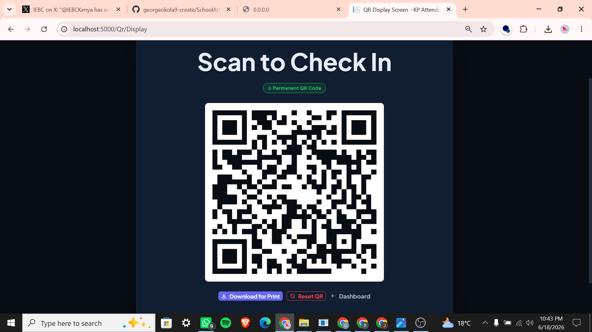
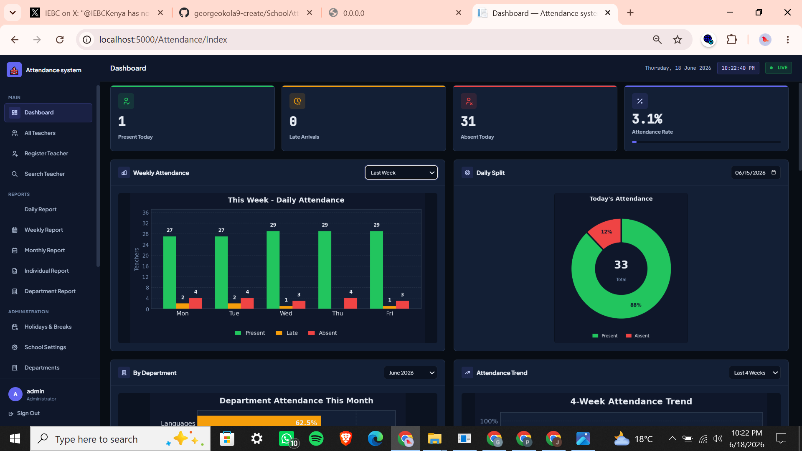
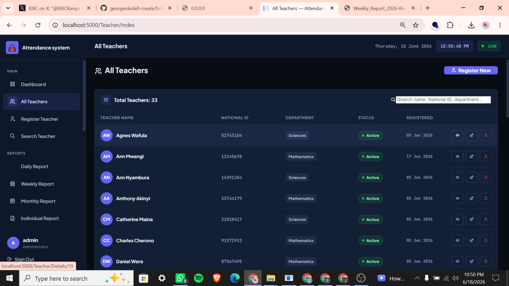
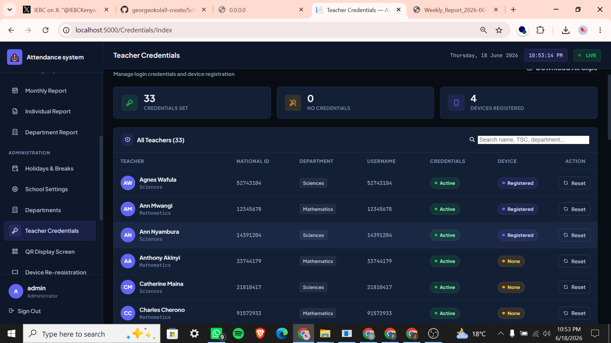
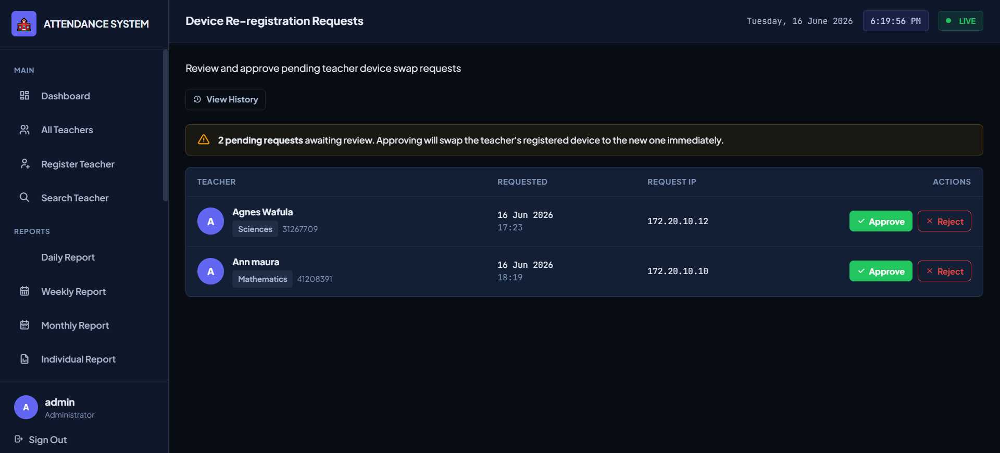
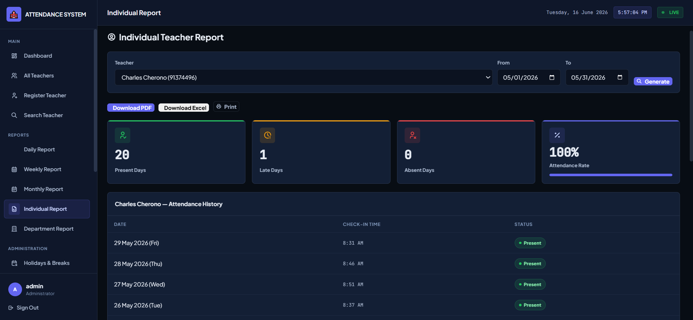
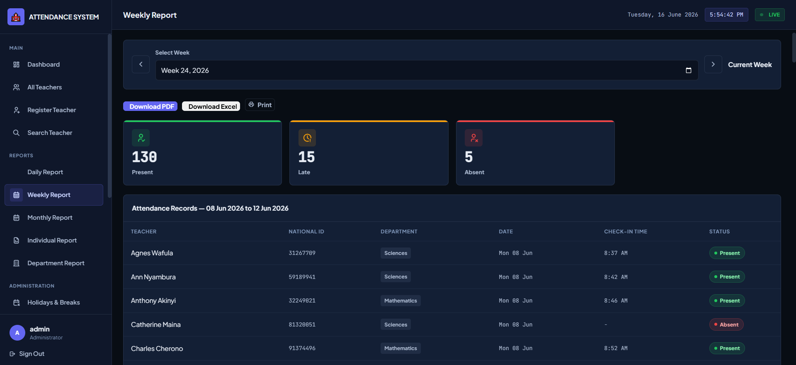
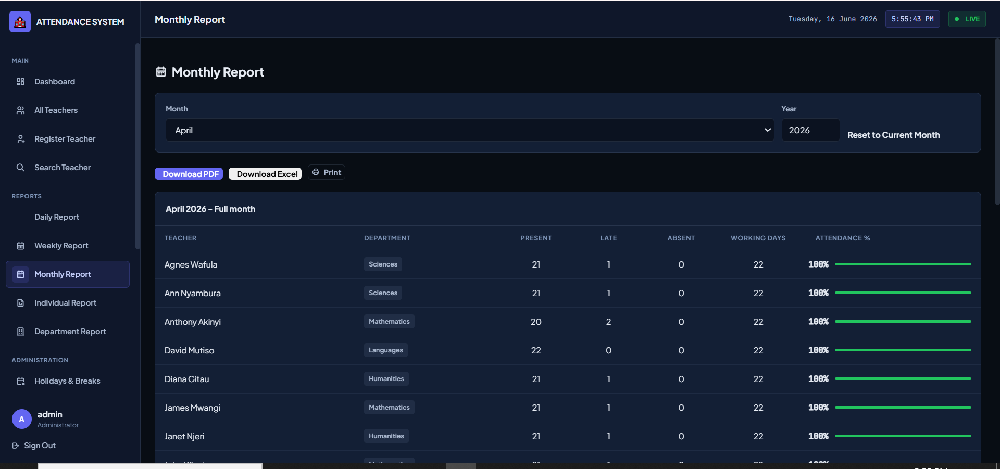
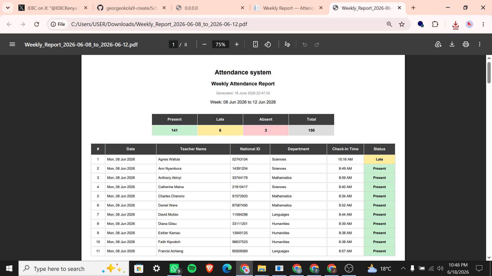
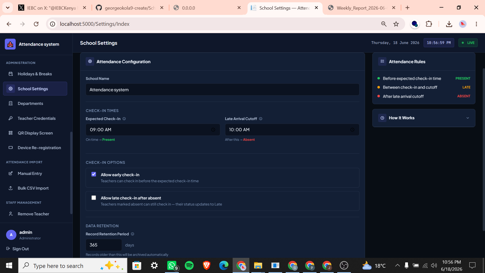

# SchoolAttendanceSystem

SchoolAttendanceSystem is a school attendance management system built with ASP.NET Core MVC. It focuses on a practical workflow: teachers check in using a QR code, administrators monitor attendance in real time, and the school can generate daily, weekly, monthly, individual, and printable reports.

This project was built as a complete school administration tool, not just a CRUD demo. It includes role-based access, teacher credential management, mobile check-in, device re-registration approval, configurable attendance rules, and report exports.

## Key Demo

### Mobile QR Teacher Check-In

This is the strongest feature of the system: a teacher uses a phone to complete attendance through the QR check-in flow.


### QR Display Screen

Administrators can display a permanent QR code for teachers to scan when checking in.



## System Highlights

### Attendance Dashboard

The dashboard gives administrators a live view of attendance totals, late arrivals, absent teachers, attendance rate, and chart-based summaries.



### Teacher Registration Workflow

The registration flow captures teacher details and creates the foundation for attendance tracking and credential assignment.


### Teacher Management

Administrators can search, view, edit, and manage teacher records, including department and active status.



### Credential and Device Management

The system supports teacher login credential generation/reset and tracks whether a teacher has registered a device.



### Device Re-Registration Approval

If a teacher changes device, the system records a re-registration request that an administrator can approve or reject.



### Attendance Reports

The reporting area supports multiple views of attendance data, including individual, weekly, and monthly summaries.







### Printable Report Output

Reports can be exported or printed for school records.



### Configurable Attendance Rules

School administrators can configure attendance timing rules such as expected check-in time, late cutoff, early check-in behavior, and record retention.



## Features

- QR-based teacher check-in
- Mobile-friendly teacher attendance flow
- Administrator, principal, and teacher login workflows
- Teacher registration and profile management
- Teacher search and active/inactive staff management
- Credential generation and password reset workflow
- Device registration and re-registration approval
- Attendance dashboard with present, late, absent, and attendance rate summaries
- Daily, weekly, monthly, individual, and department reports
- PDF/print-oriented report output
- Department and holiday management
- Configurable attendance rules and retention settings
- SQLite database storage
- SignalR notification support
- Chart generation support for dashboard/report visuals

## What This Project Demonstrates

- Full-stack ASP.NET Core MVC development
- Practical school attendance workflow design
- Clean separation between controllers, services, repositories, models, and views
- Entity Framework Core with SQLite
- Role-aware authentication flow
- Mobile-to-web workflow using QR codes
- Exportable reporting for real administrative use
- Security-conscious GitHub setup using `.gitignore` and `appsettings.Example.json`
- Handling real-world edge cases such as teacher device changes

## Tech Stack

- ASP.NET Core MVC
- C#
- Entity Framework Core
- SQLite
- Razor Views
- Bootstrap
- jQuery
- SignalR
- QuestPDF
- iText7
- ClosedXML
- Python chart generation

## Project Structure

```text
SchoolBiometricSystem/
├── Controllers/       MVC controllers for attendance, reports, QR, teachers, settings, and authentication
├── Data/              Entity Framework database context and demo data seeding
├── Models/            Domain models and view models
├── Repositories/      Data access layer
├── Services/          Business logic for attendance, reports, QR check-in, email, and credentials
├── Views/             Razor pages grouped by feature
├── wwwroot/           Static CSS, JavaScript, libraries, and public assets
├── PythonCharts/      Chart generation script
├── Migrations/        Entity Framework database migrations
├── Program.cs         Application startup and dependency injection setup
└── appsettings.Example.json
```

## Configuration

To run the project locally:

1. Copy `appsettings.Example.json`.
2. Rename the copy to `appsettings.json`.
3. Fill in your own values for the SQLite connection string, QR token secret, admin/principal passwords, email SMTP settings, and check-in rules.

## Running Locally

Restore packages:

```powershell
dotnet restore
```

Build the project:

```powershell
dotnet build SchoolBiometricSystem.csproj
```

Run the project:

```powershell
dotnet run --project SchoolBiometricSystem.csproj
```

Open the app:

```text
http://localhost:5000
```

## Database

The app uses SQLite. The local database path is configured in `appsettings.json`.

The repository includes an example configuration file for setup, while local configuration, generated files, logs, and database files are excluded from source control.
